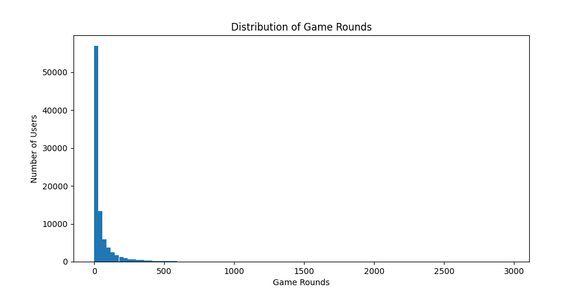
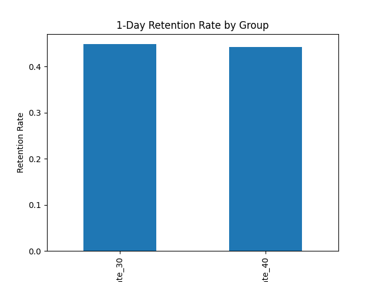
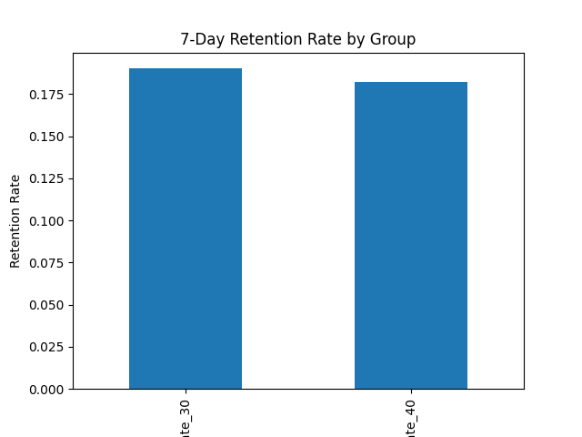
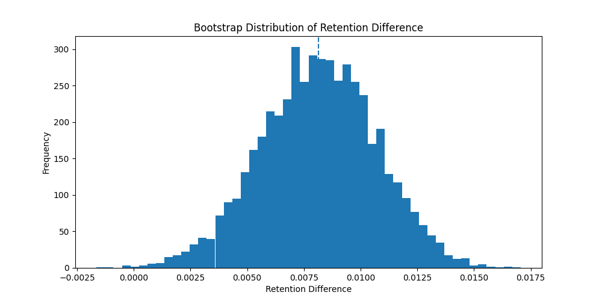

# cookie-cats-ab-test
# Cookie Cats A/B Test Analysis

## Project Overview

This project analyzes an A/B testing experiment from the mobile game Cookie Cats.

The company tested whether moving the first gameplay gate from level 30 to level 40 would improve player retention and long-term engagement.

Using statistical analysis and hypothesis testing, this project evaluates the impact of the experimental change on both short-term and long-term retention metrics.

---

## Business Background

Cookie Cats is a mobile puzzle game where players progress through levels over time.

To encourage engagement and monetization, the game introduces “gates” that temporarily stop player progress unless they wait or make a purchase.

The company conducted an A/B test:

- **gate_30 (Control Group):** first gate appears at level 30
- **gate_40 (Treatment Group):** first gate appears at level 40

The objective was to determine whether delaying the gate would improve user retention.

---

## Business Question

Does moving the first gate from level 30 to level 40 significantly improve player retention?

---

## Dataset

Source:

- Kaggle Cookie Cats A/B Testing Dataset

Main features:

| Column | Description |
|---|---|
| userid | Unique player ID |
| version | Experiment group |
| sum_gamerounds | Total number of game rounds played |
| retention_1 | Returned after 1 day |
| retention_7 | Returned after 7 days |

---

## Tech Stack

- Python
- Pandas
- NumPy
- Matplotlib
- SciPy
- Statsmodels

---

## Project Workflow

### 1. Data Cleaning

- Checked missing values
- Checked duplicate records
- Verified experiment group balance

### 2. Exploratory Data Analysis (EDA)

- Analyzed game round distribution
.
- Identified skewed user behavior
- Visualized player engagement distribution

### 3. Outlier Detection

- Detected extreme gameplay outliers
.
- Removed abnormal records for more reliable analysis

### 4. Retention Analysis

Compared:

- 1-day retention
- 7-day retention

Between:

- gate_30
- gate_40

### 5. Hypothesis Testing

Applied:

- Two-proportion Z-test
- Statistical significance testing
- p-value analysis

### 6. Bootstrap Analysis

Used bootstrap resampling to estimate:

- Retention difference distribution
- Experiment stability

### 7. Confidence Interval Estimation

Calculated 95% confidence intervals to validate experiment reliability.

---

## Key Findings

### 1-Day Retention

- The difference between groups was NOT statistically significant.
- p-value > 0.05


### 7-Day Retention

- The difference between groups WAS statistically significant.
- gate_30 achieved higher long-term retention.


### Bootstrap Result

- Bootstrap distribution consistently favored gate_30.
- Confidence interval did not include 0.
.
---

## Business Insights

The analysis suggests that delaying gameplay friction from level 30 to level 40 did not improve long-term player retention.

In fact, the original gate_30 design produced significantly better 7-day retention results.

This indicates that introducing moderate challenges earlier in the user journey may strengthen player engagement and habit formation.

From a product strategy perspective, maintaining the original gate_30 design appears to be the better business decision.

---

## Project Structure

```text
cookie-cats-ab-test/
│
├── data/
├── notebook/
│   └── cookie-cats-ab-test-analysis.ipynb
├── charts/
├── README.md
└── requirements.txt
```

---

## Skills Demonstrated
Data Cleaning & Preprocessing
Exploratory Data Analysis
A/B Testing
Hypothesis Testing
Bootstrap Resampling
Confidence Interval Analysis
Product Analytics
User Retention Analysis
Business Insight Generation
Future Improvements

---

## Possible future extensions:

- User segmentation analysis
- Bayesian A/B testing
- Survival analysis
- Advanced retention modeling
- Interactive dashboard visualization

---

## Author

 - Data Analytics Portfolio Project
